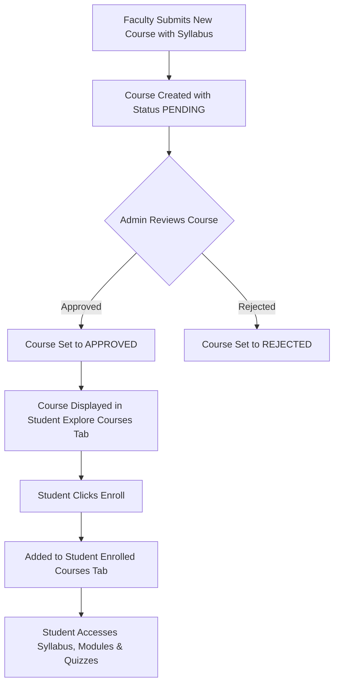
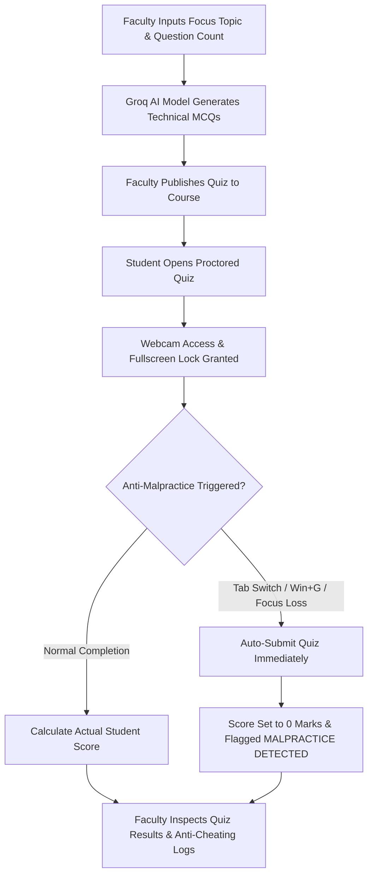
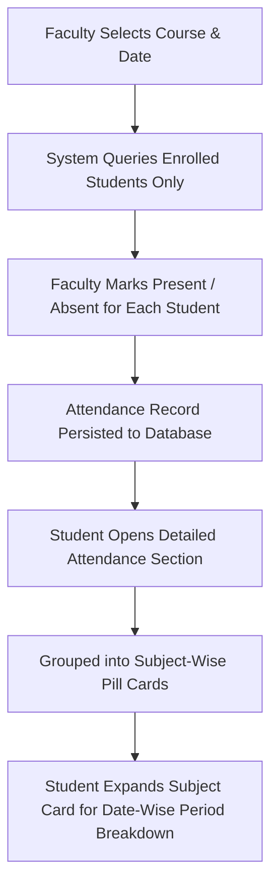

# 📄 Lumen LMS - Product Requirements Document (PRD) & Workflow Specification
*Client Demo Documentation & Technical System Architecture*

---

## 1. Executive Product Overview
**Lumen LMS** is a modern, enterprise-grade Learning Management System tailored for universities, technical institutions, and corporate training programs. It features automated AI quiz generation, strict anti-cheating proctoring safeguards, subject-wise attendance tracking, assignment evaluation pipelines, real-time relative time announcements, and interactive AI mock interviewing.

---

## 2. Target User Personas & Modules

### 👑 1. Administrator Portal (System Governance)
- **Role Category Cards**: Overview header showing total registered platform members and 3 dedicated role cards (**Admin Users**, **Faculty Members**, **Student Users**).
- **User Governance**: Filter, search, and verify users by role or email.
- **Course Approvals**: Review pending courses created by faculty and approve/reject them for platform-wide availability.
- **Global Announcements**: Broadcast campus-wide notifications to faculty and students.

### 👨‍🏫 2. Faculty Portal (Course Management & Assessment)
- **Course Workspace**: Upload course resources (YouTube videos, PDF syllabus notes, external links, rich text modules).
- **Groq AI Quiz Generator**: Input a focus topic (e.g. *Basics of Cache Memory*) and generate technical MCQs using Groq LLM (`openai/gpt-oss-120b`).
- **Anti-Cheating Proctoring & Results**: Inspect student attempt histories, anti-malpractice auto-submission logs, and student score percentages.
- **Subject Attendance Marking**: Select course and date to mark enrolled students `PRESENT` or `ABSENT`.
- **Assignment Correction**: Review student PDF submissions, grade marks, provide feedback, and inspect class performance bar charts.
- **Course Announcements**: Publish course-specific updates with automated relative time formatting (< 10m = *Just now*, 10-59m = *10m ago*, 1-23h = *1h ago*).

### 🎓 3. Student Portal (Learning Hub & Career Prep)
- **2-Tab Course Navigation Bar**:
  - **Enrolled Courses**: View active courses with dynamic progress calculation $$\text{Progress \%} = \left( \frac{\text{Completed Items}}{\text{Total Course Materials}} \right) \times 100$$ and green completion indicators.
  - **Explore New Courses**: Browse approved platform courses for 1-click self-enrollment.
- **Proctored Quiz Engine**: Take AI or manual quizzes with mandatory webcam access, full-screen lock, and anti-malpractice focus detection (auto-submitting with 0 score on cheating).
- **Subject-Wise Expandable Attendance**: View overall attendance rates per subject (`88% Overall Attendance`) with date-wise period expandable breakdowns.
- **Assignment Submissions**: Upload PDF assignments and view faculty feedback.
- **AI Mock Interview Assistant**: Practice real-time voice/text interviews with adaptive feedback.

---

## 3. End-to-End System Workflows

### 3.1 Course Approval & Student Enrollment Workflow

### 3.2 AI Quiz Generation & Proctored Execution Workflow

### 3.3 Subject Attendance & Student History Workflow

---

## 4. Technical Architecture & Tech Stack

| Layer | Component | Specification |
| :--- | :--- | :--- |
| **Frontend** | React 18 + TypeScript | Vite bundler, single page app architecture |
| **Styling** | Vanilla CSS + Tailwind CSS | Dynamic HSL theme tokens, smooth glassmorphism, responsive grid |
| **Icons & Charts** | Lucide React + Recharts | High-impact UI badges and interactive score bar charts |
| **Backend API** | Node.js + Express.js | REST APIs, JWT token authorization, controller layer |
| **Database** | Sequelize ORM + SQLite / Postgres | Relational data persistence for users, courses, quizzes, submissions |
| **AI Integration** | Groq SDK (`openai/gpt-oss-120b`) | Sub-second AI quiz generation & mock interview intelligence |
| **Proctoring Security** | Web Media API | Camera stream capture, fullscreen lock API, window blur listeners |

---

## 5. Summary of Key Work Accomplished
- **Role Category Cards**: Overhauled Admin User Management into 3 role category cards with top counter banner.
- **2-Tab Course Navigation**: Replaced stacked sections with a side-by-side **Enrolled Courses** vs **Explore New Courses** navbar.
- **Dynamic Progress & Green Completion**: Completed files, quizzes, and assignments turn green (`border-emerald-500/30 bg-emerald-500/10`) with dynamic percentage calculations.
- **Subject-Wise Expandable Attendance**: Grouped attendance rates into `rounded-[28px]` pill cards with date-wise period breakdowns.
- **Anti-Malpractice Engine**: Fullscreen lockout, webcam requirement, auto-submission, and strict 0-score enforcement on cheating attempts.
- **Course Announcement Filter & Relative Timestamps**: UTC-synced ISO dates (< 10m = *Just now*, 10-59m = *10m ago*, 1-23h = *1h ago*).
- **Groq AI Model Integration**: Powered by Groq's high-speed `openai/gpt-oss-120b` engine for technical quiz generation and mock interviews.

---
© 2026 Lumen LMS Project. All Rights Reserved.
