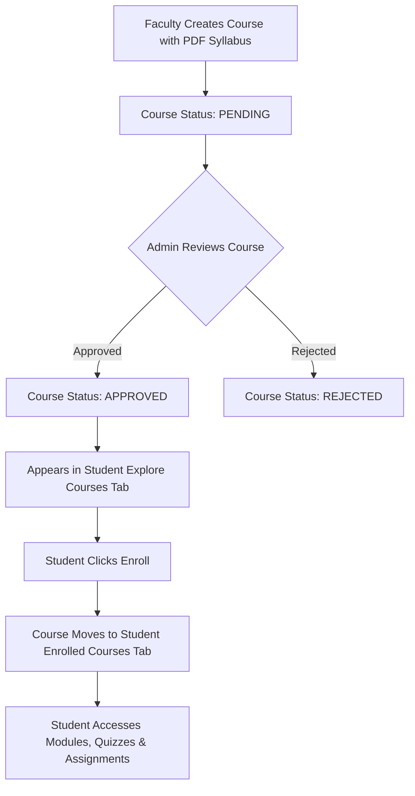
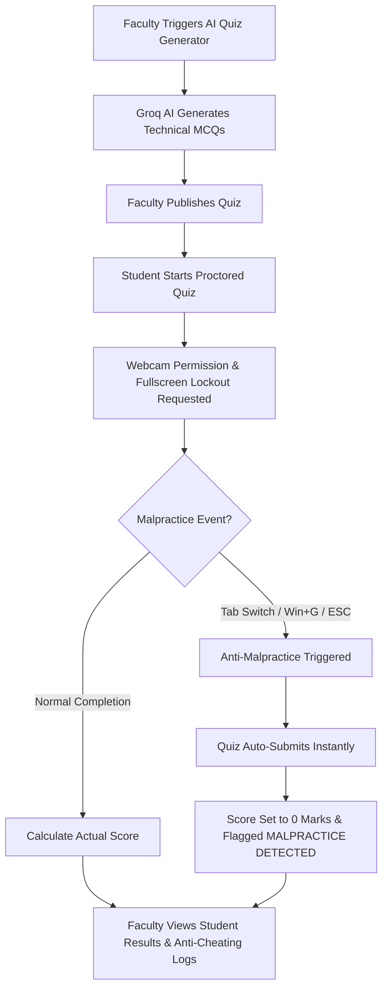
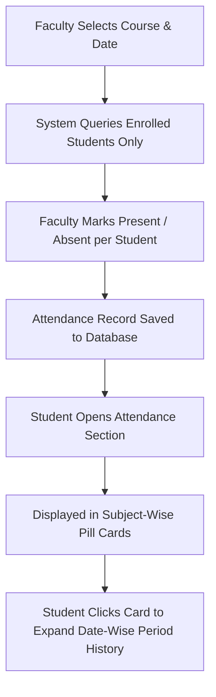

# 🚀 Lumen LMS - AI-Powered Enterprise Learning Management System
### *Product Requirements Document (PRD), System Architecture & End-to-End Workflow Specification*

Lumen LMS is an enterprise-grade, production-ready Learning Management System designed for modern educational institutions, universities, and technical learning centers. It bridges the gap between traditional learning and AI-assisted education by integrating automated proctoring, AI quiz generation, dynamic attendance tracking, role-based workflows, and real-time performance analytics.

---

## 📋 Table of Contents
1. [Executive Summary & Product Vision](#1-executive-summary--product-vision)
2. [Platform User Roles & Access Hierarchy](#2-platform-user-roles--access-hierarchy)
3. [Comprehensive Module Breakdown](#3-comprehensive-module-breakdown)
   - [3.1 User Management & Role Governance](#31-user-management--role-governance)
   - [3.2 Course Lifecycle & Enrollment Engine](#32-course-lifecycle--enrollment-engine)
   - [3.3 Course Content & Dynamic Progress Tracking](#33-course-content--dynamic-progress-tracking)
   - [3.4 AI Quiz Generator & Anti-Malpractice Proctoring](#34-ai-quiz-generator--anti-malpractice-proctoring)
   - [3.5 Subject-Wise Attendance & Detailed History](#35-subject-wise-attendance--detailed-history)
   - [3.6 Assignments & Evaluation Center](#36-assignments--evaluation-center)
   - [3.7 Announcements & Relative Time Updates](#37-announcements--relative-time-updates)
   - [3.8 AI Mock Interview Assistant](#38-ai-mock-interview-assistant)
4. [End-to-End System Workflows](#4-end-to-end-system-workflows)
5. [Technology Stack & Integration Architecture](#5-technology-stack--integration-architecture)
6. [Getting Started & Local Setup](#6-getting-started--local-setup)

---

## 1. Executive Summary & Product Vision

Lumen LMS provides a seamless digital campus environment where Admins govern platform activity, Faculty build and evaluate interactive courses, and Students experience personalized, gamified, and proctored learning.

### Key Differentiators:
- **Groq AI Integration (`openai/gpt-oss-120b`)**: Sub-second generation of technical multiple-choice quizzes and interactive mock interviews.
- **Anti-Malpractice Security Engine**: Webcam monitoring, mandatory full-screen lockouts, focus tracking, and auto-submission with 0-score enforcement on cheating detection.
- **Subject-Wise Expandable Attendance**: Grouped attendance rates per enrolled course with date-wise period breakdowns.
- **2-Tab Course Navigation Bar**: Side-by-side tabbed layout for *Enrolled Courses* vs *Explore New Courses*.
- **Real-Time Relative Timestamps**: UTC-synced announcement delivery timestamps (< 10m = *Just now*, 10-59m = *10m ago*, 1-23h = *1h ago*).

---

## 2. Platform User Roles & Access Hierarchy

```
                    ┌─────────────────────────┐
                    │   System Administrator  │
                    │         (ADMIN)         │
                    └────────────┬────────────┘
                                 │
           ┌─────────────────────┴─────────────────────┐
           ▼                                           ▼
┌─────────────────────┐                     ┌─────────────────────┐
│  Faculty Member     │                     │    Student User     │
│      (FACULTY)      │                     │      (STUDENT)      │
└─────────────────────┘                     └─────────────────────┘
```

1. **System Administrator (`ADMIN`)**:
   - Manages platform users across 3 distinct role categories (Admin, Faculty, Student).
   - Approves or rejects new course proposals submitted by faculty.
   - Monitors global platform analytics and system announcements.

2. **Faculty / Instructor (`FACULTY`)**:
   - Creates course syllabus and uploads learning resources (PDFs, YouTube videos, links).
   - Generates AI quizzes using Groq models or builds manual custom quizzes.
   - Monitors student quiz attempts, score histories, and anti-cheating logs.
   - Marks daily subject attendance for enrolled students.
   - Grades student assignment PDF submissions and publishes course announcements.

3. **Student / Learner (`STUDENT`)**:
   - Navigates enrolled courses and explores new courses for 1-click self-enrollment.
   - Tracks dynamic course progress (%) with green completion badges.
   - Takes proctored quizzes with webcam proctoring and anti-cheating safeguards.
   - Submits PDF assignments and reviews detailed evaluation feedback.
   - Views subject-wise overall attendance rates and date-wise period histories.
   - Practices technical interviews with the AI Mock Interviewer.

---

## 3. Comprehensive Module Breakdown

### 3.1 User Management & Role Governance
- **Role Category Cards**: Top summary banner (`Total Members: X Users Registered`) and 3 role category cards (**Admin Users**, **Faculty Members**, **Student Users**).
- **User Filtering & Search**: Admins can search users by name or email, view role badges, and manage account statuses.

### 3.2 Course Lifecycle & Enrollment Engine
- **Course Creation & Submission**: Faculty submit new courses with course codes (e.g. `23COA1`), title, description, and attached PDF syllabus.
- **Admin Approval Pipeline**: Courses enter `PENDING` state until an Admin reviews and sets them to `APPROVED`.
- **Side-by-Side 2-Tab Navigation Bar**:
  - **Enrolled Courses Tab**: Displays courses in which the student is active, complete with dynamic progress bars and green visual indicators for completed modules.
  - **Explore New Courses Tab**: Displays all approved platform courses available for instant self-enrollment.

### 3.3 Course Content & Dynamic Progress Tracking
- **Multi-Format Learning Modules**: Supports YouTube video players, PDF view/download links, external reference links, and rich text lessons.
- **Dynamic Progress Calculation**:
  $$\text{Progress \%} = \left( \frac{\text{Completed Items}}{\text{Total Course Material Items}} \right) \times 100$$
- Completed items automatically turn green (`border-emerald-500/30 bg-emerald-500/10`) with `CheckCircle2` checkmarks.

### 3.4 AI Quiz Generator & Anti-Malpractice Proctoring
- **Groq AI Quiz Engine**: Faculty input a specific focus topic (e.g., *Basics of Cache Memory*) and question count. The AI engine (`openai/gpt-oss-120b`) generates technical MCQs strictly testing subject concepts.
- **Proctored Execution Environment**:
  - **Webcam & Fullscreen Lockout**: Requires active camera permissions and fullscreen lock before starting.
  - **Anti-Malpractice Detector**: Monitors tab switches, focus loss, ESC key exits, and system shortcut key combinations (such as `Win+G`).
  - **Auto-Submission & Zero Score Enforcement**: When malpractice occurs, the session immediately terminates, flags `MALPRACTICE DETECTED`, and sets score strictly to **0% (0 out of 20 marks)**.
- **Faculty Results & Anti-Cheating Logs**: Displays student attempt history (sorted by latest attempt) with malpractice status indicators.

### 3.5 Subject-Wise Attendance & Detailed History
- **Faculty Marking System**: Faculty select a course and date to mark enrolled students as `PRESENT` or `ABSENT`. Strictly queries enrolled students (no fallback to non-enrolled platform users).
- **Student Subject Cards**: Rounded `28px` pill cards displaying subject attendance percentage (e.g., `88% Overall Attendance`) with date-wise period expandable breakdowns.

### 3.6 Assignments & Evaluation Center
- **Publishing & Submission**: Faculty publish assignments with total marks and due dates. Students upload completed PDF documents.
- **Grading & Analytics**: Faculty review student submissions, award marks, write feedback, and view class score performance bar charts.

### 3.7 Announcements & Relative Time Updates
- **Audience Targeting**: Broadcast updates to `ALL`, `FACULTY`, or `STUDENTS`.
- **Course Workspace Isolation**: Announcements inside a course workspace strictly display updates relevant to that specific course.
- **Relative Time Calculation**:
  - `< 10m`: `Just now`
  - `10-59m`: `10m ago`, `20m ago`...
  - `1-23h`: `1h ago`, `2h ago`...
  - `24h+`: `1d ago`, `2d ago`...

### 3.8 AI Mock Interview Assistant
- Interactive voice/text mock interview session powered by Groq LLMs providing real-time feedback, domain scoring, and skill improvement recommendations.

---

## 4. End-to-End System Workflows

### 4.1 Course Creation & Student Enrollment Lifecycle


### 4.2 Proctored Quiz & Anti-Malpractice Workflow


### 4.3 Subject Attendance & Student History Workflow


---

## 5. Technology Stack & Integration Architecture

| Layer | Technology | Function / Responsibility |
| :--- | :--- | :--- |
| **Frontend Framework** | React 18 & TypeScript | Component architecture with strict typing |
| **Build Tool & Routing** | Vite & TanStack Router | Fast HMR development and SPA routing |
| **Styling & Icons** | Vanilla CSS & Tailwind CSS | Dynamic theme system, HSL color tokens, Lucide icons |
| **Charts & Analytics** | Recharts | Class performance bar charts & attendance trends |
| **Backend Runtime** | Node.js & Express.js | REST API server, authentication middleware, controllers |
| **Database & ORM** | SQLite / Postgres & Sequelize | Relational data persistence, schema migrations, models |
| **AI Engine** | Groq SDK (`openai/gpt-oss-120b`) | AI quiz generation & mock interview intelligence |
| **Proctoring Security** | HTML5 Web Media API | Camera stream capture, fullscreen API, window focus listeners |

---

## 6. Getting Started & Local Setup

### Prerequisites
- Node.js (v18 or higher)
- npm or yarn package manager

### 1. Backend Setup
```bash
cd lms-backend
npm install
node server.js
```
*Backend runs on `http://localhost:8082`*

### 2. Frontend Setup
```bash
cd study-shine-joy-main
npm install
npm run dev
```
*Frontend runs on `http://localhost:8080`*

### Demo Credentials
- **Admin**: `admin@example.com` / `password123`
- **Faculty**: `faculty@example.com` / `password123`
- **Student**: `student@example.com` / `password123`

---
© 2026 Lumen LMS Project. All Rights Reserved.
